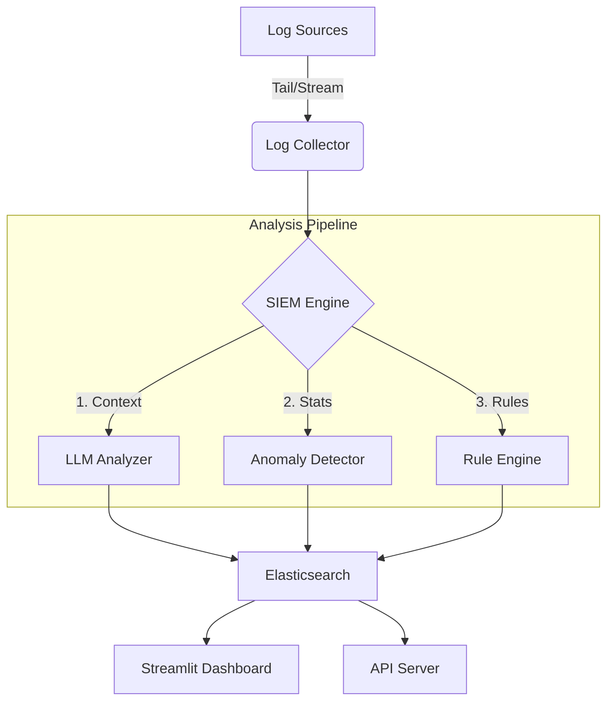

# System Architecture

This document describes the high-level architecture of the AI-Powered SIEM system.

## 🏗️ High-Level Overview

The system consists of four main components:
1.  **Log Collector**: Ingests logs from various sources.
2.  **Analysis Engine**: Processes logs using AI and Rules.
3.  **Storage**: Indexes logs in Elasticsearch.
4.  **Dashboard**: Visualizes data for the analyst.

## 🧩 Components

### 1. Log Collector (`log_collector.py`)
-   **Role**: Watches files (like `syslog`) or listens on ports.
-   **Mechanism**: Uses `aiofiles` for asynchronous file tailing.
-   **Output**: Stream of raw log lines.

### 2. SIEM Engine (`siem_engine.py`)
-   **Role**: The central brain. Orchestrates the analysis pipeline.
-   **Pipeline**:
    1.  **LLM Analysis**: Calls `llm_analysis.py` (Ollama/Gemini) to enrich logs with severity and explanation.
    2.  **Anomaly Detection**: Uses `IsolationForest` (`anomaly_detection.py`) to score logs based on statistical rarity.
    3.  **Rule Engine**: Checks against defined patterns (`rule_engine.py`) like "3 failed logins in 1 min".

### 3. Storage (`storage.py`)
-   **Technology**: Elasticsearch 9.x.
-   **Index**: `siem_logs`.
-   **Security**: Basic Auth enabled (User: `elastic`).

### 4. Dashboard (`dashboard.py`)
-   **Technology**: Streamlit.
-   **Features**: Real-time alerts, interactive charts (Altair), and log search.

## 🔄 Data Flow
1.  Log line enters **Collector**.
2.  **SIEM Engine** receives the line.
3.  **LLM** analyzes text -> Adds `ai_analysis` field.
4.  **Anomaly Detector** calculates score -> Adds `anomaly_score`.
5.  **Rule Engine** checks state -> Triggers `RULE ALERT` if matched.
6.  Enriched log is saved to **Elasticsearch**.
7.  **Dashboard** polls Elasticsearch to update the UI.
